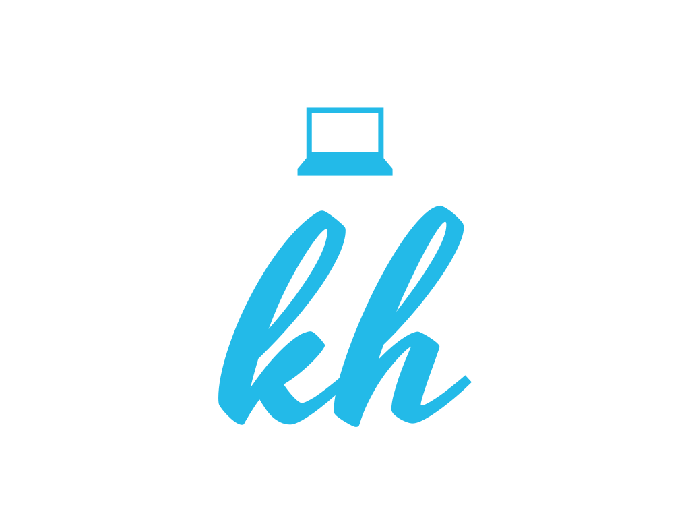

# Personal Portfolio
> Personal portfolio built with GatsbyJS.

[](https://app.netlify.com/sites/quirky-stonebraker-270cfd/deploys)

<a href="https://kaitlinhuss.com/">
  
</a>

## Getting Started

### Prerequisites
* Node
* gatsby-cli 

### Running

```
gatsby develop
```

## Built With

* [gatsby-starter-default](https://www.gatsbyjs.org/starters/gatsbyjs/gatsby-starter-default/) - Starter provided by Gatsby

## Pending Work 

* Incorporating media queries to make site mobile-friendly and responsive. 
* Add unit testing.